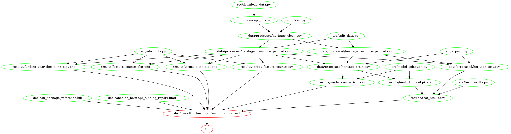

# Canadian Heritage Funding Size for Art Projects

-   contributors: Artan Zandian, Joyce Wang, Amelia Tang, Wenxin Xiang

## About

We attempt to build a multi-class classification model which can use
features not indicative of artistic merit, such as location, audience,
and discipline to predict the funding size granted by the Canadian
Heritage Fund (The Fund). We used four popular algorithms for
classification questions, including logistics regression, Naive Bayes,
Support Vector Classification (SVC) and Random Forest initially. We also
used `dummyclassifer` as a base case. Then, we selected Random Forest as
the best algorithm for our question based on each model’s
cross-validation scores. We then further conducted hyperparameter
optimization on the Random Forest model. Our model performs reasonably
well comparing to the base case `dummyclassifer` with a macro average
f-1 score of 0.7 and a weighted-average f-1 score of 0.69. However, we
also observed that the model performs worse at classifying funding sizes
in range of `$12.0-23.0K` and `$23.0-50.0K` comparing to classifying
other ranges. Thus, we suggest further study to improve this
classification model.

The data set used in this project is provided by the Department of
Canadian Heritage (DCH) available on the Government of Canada’s Open
Data website and can be found
[here](https://open.canada.ca/data/en/dataset/92984c11-6fd4-40c4-b23c-e8832e1f4cd5)).
Each row of the data set represents an art project funded by the Fund
and provides the project’s name, location information (community, city,
region and province), presenter information (associated organizations,
disciplines, festival or series presentations, etc.), grant or
contribution, and audience. The size of the funding approved for each
art project is reported by the Fund.

## Report

The final report can be found
[here](https://htmlpreview.github.io/?https://github.com/UBC-MDS/canadian_heritage_funding/blob/main/doc/canadian_heritage_funding_report.html).

## Usage

### Creating the environment

`conda env create --file environment.yaml`

Run the following command from the environment where you installed
JupyterLab.

`conda install nb_conda_kernels`

If you are a windows user, run the following command inside the newly
created environment to install vega-lite.

`npm install -g vega vega-cli vega-lite canvas`

For M1 mac users, make sure you are using the `x86` version of conda and
not the `arm64` version. See
[here](https://github.com/conda-forge/miniforge#miniforge3) and
[here](https://github.com/mwidjaja1/DSOnMacARM/blob/main/README.md) for
more info.

### To replicate the analysis
Clone this Github repository, install the dependencies, and run the 
following commands at the command line/terminal from the root directory of the project:

    make all

To reset the repo to the original state, and delete all results files
and report, run the following commands at the command line/terminal from
the root directory of the project:

    make clean

## Dependencies

A complete list of dependencies is available
[here](https://github.com/UBC-MDS/canadian_heritage_funding/blob/main/environment.yaml).
 - Python 3.9.7 and Python packages:  - docopt==0.6.1  -
pandas==1.3.3  - numpy==1.21.2  - altair_saver=0.5.0  -
altair=4.1.0  - scikit-learn=1.0

## Replicating the analysis using Docker
If you would like to replicate the analysis using Docker, pull the docker image
with the following command:

`docker pull artanzandian/canadian_heritage_funding`

From the root of this project, run the following command to replicate the analysis:

`docker-compose run --rm report-env make -C //home//jovyan//work all`

To reset the project to the original state, and delete all result files and report, 
run the following command:

`docker-compose run --rm report-env make -C //home//jovyan//work clean`

## Makefile dependency diagram

## License

All Open Government data - Canada is made available under the Open
Government License Canada. For a summary of the license see
[here](https://github.com/UBC-MDS/canadian_heritage_funding/blob/main/LICENSE.md).
If reusing please provide attribution and link to this webpage.

## References

“Grouped Arts Evaluation: Canada Arts Presentation Fund, Canada Cultural Spaces Fund, and Canada Cultural Investment Fund 2013-14 to 2017-18_2019.” 2019. The Government of Canada. https://www.canada.ca/en/canadian-heritage/corporate/publications/evaluations/grouped-art-evaluation.html#a1.

Harris, Charles R., K. Jarrod Millman, Stéfan J van der Walt, Ralf Gommers, Pauli Virtanen, David Cournapeau, Eric Wieser, et al. 2020. “Array Programming with NumPy.” Nature 585: 357–62. https://doi.org/10.1038/s41586-020-2649-2.

McKinney, Wes et al. 2010. “Data Structures for Statistical Computing in Python.” In Proceedings of the 9th Python in Science Conference, 445:51–56. Austin, TX.

Pedregosa, Fabian, Gaël Varoquaux, Alexandre Gramfort, Vincent Michel, Bertrand Thirion, Olivier Grisel, Mathieu Blondel, et al. 2011. “Scikit-Learn: Machine Learning in Python.” Journal of Machine Learning Research 12 (Oct): 2825–30.

Santini, Lauryn. 2013. “Public Funding of the Visual Arts in Canada: Keeping Creativity at an Arm’s Length.” PhD thesis, Sotheby’s Institute of Art-New York.
Van Rossum, Guido, and Fred L. Drake. 2009. Python 3 Reference Manual. Scotts Valley, CA: CreateSpace.
