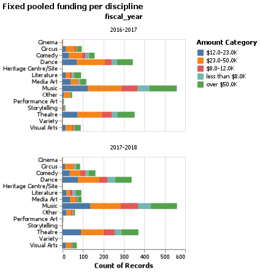

```{r setup, include=FALSE}
knitr::opts_chunk$set(echo = FALSE)
library(knitr)
library(kableExtra)
library(tidyverse)
```

```{r read_test_score, include=FALSE}
test_score <- read_csv("../results/test_result.csv") |>
  select(1,2,3,4)
``` 

# Summary

We attempt to build a multi-class classification model which can use features not indicative of artistic merit, such as location, audience, and discipline to predict the funding size granted by the Canadian Heritage Fund (The Fund). We used four popular algorithms for classification questions, including logistics regression, Naive Bayes, C-Support Vector Classification (SVC) and Random Forest initially. We also used `dummyclassifer` as a base case. Then, we selected Random Forest as the best algorithm for our question based on each model's cross-validation scores. We then further conducted hyperparameter optimization on the Random Forest model. Our model performs reasonably well comparing to the base case `dummyclassifer` with a macro average f-1 score of `r round(test_score$'f1-score'[7], 2)` and a weighted-average f-1 score of `r round(test_score$'f1-score'[8], 2)`. However, we also observed that the model performs worse at classifying funding sizes in range of `$12-23K` and `$23-50K`. Thus, we suggest further study to improve this classification model.    

# Introduction

For this project, we are trying to answer two intriguing questions: given information non-indicative of artistic merit, such as location, audience, and discipline, what would be the funding size for art projects related to Canadian heritage? Can we make reasonable predictions? The significance of answering the questions lies in our unanimous support for preserving Canadian heritage through artistic expressions. Amidst controversies over governmental involvements in arts, the Canada Council for the Arts (the Council) has been fostering creativity through allocating government funding to selected art projects. The Council’s judging criteria emphasizes artistic merit instead of social and political influences[@santini2013public]. 

Meanwhile, under the Department of Canadian Heritage (DCH), the Canada Arts Presentation Fund (the Fund) financially supports art festival presenters and performing arts series presenters in all regions in Canada. The Fund’s performance is mainly evaluated based on the diversity of the grantees or awardees instead of artistic merit [@CandanaEvaServices]. Therefore, it is in the interest of us Canadian heritage supporters to predict the size of the funds based on features not indicative of artistic merit, but those reflecting diversity, socially, culturally and geographically.

# Methods

## Data
The data set used in this project is provided by the Department of Canadian Heritage (DCH) available on the Government of Canada’s Open Data website and can be found [here](https://open.canada.ca/data/en/dataset/92984c11-6fd4-40c4-b23c-e8832e1f4cd5)). Each row of the data set represents an art project funded by the Fund and provides the project’s name, location information (community, city, region and province), presenter information (associated organizations, disciplines, festival or series presentations, etc.), grant or contribution, and audience. The size of the funding approved for each art project is reported by the Fund.

We observed that the `amount_approved` in the original data set is not continuous. Therefore, we divided the values into five categories: `less than $8k`, `$8k` stands for funding size in the range of 8k to 10k in CAD, `$12` stands for funding size in the range of 12k to 23k in CAD, `$23k` stands for funding size in the range of 23k to 50k in CAD and `50k` stands foring finding size larger than 50k in CAD. 

We dropped the feature `fiscal_year` because the distributions for arts in each discipline across funding sizes stayed the same year over year. See the Figure 1 below for detailed distributions: 

```{r drop-fiscal-year, fig.align = 'center', echo=FALSE, fig.cap="Figure 1. Comparison of the distribution of funding sizes 2016-2017 vs 2017-2018", out.width = '50%'}

```
We dropped feature `region` from the original data because there is another feature `province` that is indicate of region already. We also dropped `organization_name` and `disciplines_other` because the features are not informative.   

We look at the distribution of the target, the funding size approved. According to Table 1, we have observed some class imbalance but it is not too concerning. 

```{r target-count, message=FALSE, warning=FALSE, echo=FALSE, fig.cap="Table 1. Count of each funding size. Observed class imbalance", out.width = '100%'}
target_count <- read_csv("../results/target_feature_counts.csv") |>
  rename(funding_size = amount_category)
target_count |>
  kbl(caption = "Table 1. Count of each funding size. Observed class imbalance") |>
  kable_styling()
```

## Analysis
Other than `fiscal_year`, `region`, `disciplines_other`, and "`organization_name`, all features in the original data set were used to fit the models. Initially, four algorithms, logistics regression, Naive Bayes, C-Support Vector Classification (SVC) and Random Forest were used to build multi-class classification model to classify the sizes of the funding. 

The Python programming languages [@Python] and the following Python packages were used to perform the analysis: numpy [@2020NumPy-Array], pandas [@mckinney2010data], scikitlearn [@pedregosa2011scikit]. The code used to perform the analysis and create this report can be found here: https://github.com/UBC-MDS/canadian_heritage_funding.

To conduct model selection, we looked at the performance of each model and observed that random forest performs the best: 

```{r model_comparison, message=FALSE, warning=FALSE, echo=FALSE, fig.cap="Table 1. Count of each funding size. Observed class imbalance", out.width = '100%'}
model_comparison <- read_csv("../results/model_comparison.csv") |>
  slice(-c(1,2)) 

names(model_comparison)[1] <- ""

model_comparison |> 
  kbl(caption = "Table 2. Performance comparison of all models. Random Forest performs the best.") |>
  kable_styling()
```

Therefore, we selected random forest as the best performing model to conduct hyperparameter optimization and tuned `max_features`, `max_depth" and "class_weight` as well as the `max_features` argument in `CountVectorizer()`.   

# Results & Discussion

In the end, let's look at the test scores to see how our random forest model performs: 
```{r test score table, message=FALSE, warning=FALSE, out.width = '60%'}
names(test_score)[1] <- ""
test_score |>
  kbl(caption = "Table 3. Test scores for the best model") |>
  kable_styling()
```

According to Table 3, the test scores are not ideal but our model performs reasonably well. We can see a macro average recall score of `r round(test_score$recall[7], 2)`, a weighted-average recall score of `r round(test_score$recall[8], 2)` , a macro average f-1 score of `r round(test_score$'f1-score'[7], 2)` and a weighted-average f-1 score of `r round(test_score$'f1-score'[8], 2)`. Comparing to our base case model `dummyclassifer` and our previous models using other algorithms, this model has improved significantly. 

Further, we observe that the model is better at classifying funding size in the range of `less than $8k`, `$8K-$12K` and `$50K and above`. This may be caused by the class imbalance because we have more funding sizes in range of `$12-23K` and `$23-50K`. We might be able to improve the model by adjusting the target classes to make the distribution more balanced. We might also want to look further into other classifiers such as k-Nearest Neighbors to see if the scores will improve.       


# References

