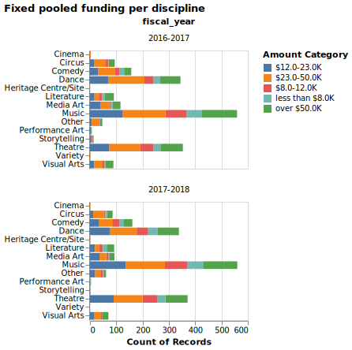

Canadian Heritage Funding Size for Art Projects
================
Artan Zandian, Joyce Wang, Amelia Tang, Wenxin Xiang  
2021/11/27 (updated: 2021-12-10)

-   [Summary](#summary)
-   [Introduction](#introduction)
-   [Methods](#methods)
    -   [Data](#data)
    -   [Analysis](#analysis)
-   [Results & Discussion](#results--discussion)
-   [References](#references)

# Summary

We attempt to build a multiclass classification model which can use
features not indicative of artistic merit, such as location, audience,
and discipline to predict the funding size granted by the Canadian
Heritage Fund (The Fund). We used four popular algorithms for
classification questions, including logistics regression, Naive Bayes,
C-Support Vector Classification (SVC) and Random Forest initially. We
also used `dummyclassifer` as a base case. Then, we selected Random
Forest as the best algorithm for our question based on each model’s
cross-validation scores. We then further conducted hyperparameter
optimization on the Random Forest model. Our model performs reasonably
well comparing to the base case `dummyclassifer` with a macro average
f-1 score of 0.69 and a weighted-average f-1 score of 0.68. However, we
also observed that the model performs worse at classifying funding sizes
in range of `$12.0-23.0K` and `$23.0-50.0K`comparing to classifying
funding sizes of other ranges. Thus, we suggest further study to improve
this classification model.

# Introduction

For this project, we are trying to answer two intriguing questions:
given information non-indicative of artistic merit, such as location,
audience, and discipline, what would be the funding size for art
projects related to Canadian heritage? Can we make reasonable
predictions? The significance of answering the questions lies in our
unanimous support for preserving Canadian heritage through artistic
expressions. Amidst controversies over governmental involvements in
arts, the Canada Council for the Arts (the Council) has been fostering
creativity through allocating government funding to selected art
projects. The Council’s judging criteria emphasizes artistic merit
instead of social and political influences(Santini 2013).

Meanwhile, under the Department of Canadian Heritage (DCH), the Canada
Arts Presentation Fund (the Fund) financially supports art festival
presenters and performing arts series presenters in all regions in
Canada. The Fund’s performance is mainly evaluated based on the
diversity of the grantees or awardees instead of artistic merit
(“Grouped Arts Evaluation: Canada Arts Presentation Fund, Canada
Cultural Spaces Fund, and Canada Cultural Investment Fund 2013-14 to
2017-18_2019” 2019). Therefore, it is in the interest of us Canadian
heritage supporters to predict the size of the funds based on features
not indicative of artistic merit, but those reflecting diversity,
socially, culturally and geographically.

# Methods

## Data

The data set used in this project is provided by the Department of
Canadian Heritage (DCH) available on the Government of Canada’s Open
Data website and can be found
[here](https://open.canada.ca/data/en/dataset/92984c11-6fd4-40c4-b23c-e8832e1f4cd5)).
Each row of the data set represents an art project funded by the Fund
and provides the project’s name, location information (community, city,
region and province), presenter information (associated organizations,
disciplines, festival or series presentations, etc.), grant or
contribution, and audience. The size of the funding approved for each
art project is reported by the Fund.

We observed that the `amount_approved` in the original data set is not
continuous. Therefore, we divided the values into five categories:
`less than $8.0k`, `$8.0k-12.0k` stands for funding size in the range of
8k to 10k in CAD, `$12.0-23.0k` stands for funding size in the range of
12k to 23k in CAD, `$23.0k-50.0k` stands for funding size in the range
of 23k to 50k in CAD and `over 50k` stands for funding size larger than
50k in CAD.

We dropped the feature `fiscal_year` because the distributions for arts
in each discipline across funding sizes stayed the same year over year.
See the Figure 1 below for detailed distributions:

We dropped feature `region` from the original data because there is
another feature `province` that is indicate of region already. We also
dropped `organization_name` because there are many unique organization
names and it might not be meaningful to learn from such feature. The
feature `disciplines_other` was dropped because the features are not
informative.

We look at the distribution of the target, the funding size approved.
According to Table 1, we have observed some class imbalance but it is
not too concerning.

<table class="table" style="margin-left: auto; margin-right: auto;">
<caption>
Table 1. Count of each funding size. Observed class imbalance
</caption>
<thead>
<tr>
<th style="text-align:left;">
Funding Size
</th>
<th style="text-align:right;">
Count
</th>
</tr>
</thead>
<tbody>
<tr>
<td style="text-align:left;">
$12.0-23.0K
</td>
<td style="text-align:right;">
266
</td>
</tr>
<tr>
<td style="text-align:left;">
$23.0-50.0K
</td>
<td style="text-align:right;">
288
</td>
</tr>
<tr>
<td style="text-align:left;">
$8.0-12.0K
</td>
<td style="text-align:right;">
161
</td>
</tr>
<tr>
<td style="text-align:left;">
less than $8.0K
</td>
<td style="text-align:right;">
121
</td>
</tr>
<tr>
<td style="text-align:left;">
over $50.0K
</td>
<td style="text-align:right;">
250
</td>
</tr>
</tbody>
</table>

## Analysis

Other than `fiscal_year`, `region`, `disciplines_other`, and
“`organization_name`, all features in the original data set were used to
fit the models. Initially, four algorithms, logistics regression, Naive
Bayes, Support Vector Classification (SVC) and Random Forest were used
to build multi-class classification model to classify the sizes of the
funding.

The Python programming languages (Van Rossum and Drake 2009) and the
following Python packages were used to perform the analysis: numpy
(Harris et al. 2020), pandas (McKinney et al. 2010), scikitlearn
(Pedregosa et al. 2011). The code used to perform the analysis and
create this report can be found here:
<https://github.com/UBC-MDS/canadian_heritage_funding>.

To conduct model selection, we looked at the performance of each model
and observed that random forest performs the best:

<table class="table" style="margin-left: auto; margin-right: auto;">
<caption>
Table 2. Performance comparison of all models. Random Forest performs
the best.
</caption>
<thead>
<tr>
<th style="text-align:left;">
</th>
<th style="text-align:right;">
Dummy Classifier
</th>
<th style="text-align:right;">
Logistic Regression
</th>
<th style="text-align:right;">
Multinomial Naive Bayes
</th>
<th style="text-align:right;">
SVC
</th>
<th style="text-align:right;">
Random Forest
</th>
</tr>
</thead>
<tbody>
<tr>
<td style="text-align:left;">
test_f1_weighted
</td>
<td style="text-align:right;">
0.1111819
</td>
<td style="text-align:right;">
0.5764213
</td>
<td style="text-align:right;">
0.4533136
</td>
<td style="text-align:right;">
0.4936329
</td>
<td style="text-align:right;">
0.6134939
</td>
</tr>
<tr>
<td style="text-align:left;">
test_recall_weighted
</td>
<td style="text-align:right;">
0.2651968
</td>
<td style="text-align:right;">
0.5755338
</td>
<td style="text-align:right;">
0.4659113
</td>
<td style="text-align:right;">
0.4907580
</td>
<td style="text-align:right;">
0.6151059
</td>
</tr>
<tr>
<td style="text-align:left;">
test_precision_weighted
</td>
<td style="text-align:right;">
0.0703360
</td>
<td style="text-align:right;">
0.5816156
</td>
<td style="text-align:right;">
0.4782065
</td>
<td style="text-align:right;">
0.5126008
</td>
<td style="text-align:right;">
0.6222255
</td>
</tr>
</tbody>
</table>

Therefore, we selected random forest as the best performing model to
conduct hyperparameter optimization and tuned `max_features` in
`CountVectorizer()`, and `max_depth" and "class_weight` as well as the
`max_features` argument in `RandomForestClassifier()`.

# Results & Discussion

In the end, let’s look at the test scores to see how our random forest
model performs:
<table class="table" style="margin-left: auto; margin-right: auto;">
<caption>
Table 3. Test scores for the best model
</caption>
<thead>
<tr>
<th style="text-align:left;">
</th>
<th style="text-align:right;">
precision
</th>
<th style="text-align:right;">
recall
</th>
<th style="text-align:right;">
f1-score
</th>
</tr>
</thead>
<tbody>
<tr>
<td style="text-align:left;">
$12.0-23.0K
</td>
<td style="text-align:right;">
0.5970149
</td>
<td style="text-align:right;">
0.5714286
</td>
<td style="text-align:right;">
0.5839416
</td>
</tr>
<tr>
<td style="text-align:left;">
$23.0-50.0K
</td>
<td style="text-align:right;">
0.5797101
</td>
<td style="text-align:right;">
0.6349206
</td>
<td style="text-align:right;">
0.6060606
</td>
</tr>
<tr>
<td style="text-align:left;">
$8.0-12.0K
</td>
<td style="text-align:right;">
0.6904762
</td>
<td style="text-align:right;">
0.7073171
</td>
<td style="text-align:right;">
0.6987952
</td>
</tr>
<tr>
<td style="text-align:left;">
less than $8.0K
</td>
<td style="text-align:right;">
0.8148148
</td>
<td style="text-align:right;">
0.6666667
</td>
<td style="text-align:right;">
0.7333333
</td>
</tr>
<tr>
<td style="text-align:left;">
over $50.0K
</td>
<td style="text-align:right;">
0.8208955
</td>
<td style="text-align:right;">
0.8461538
</td>
<td style="text-align:right;">
0.8333333
</td>
</tr>
<tr>
<td style="text-align:left;">
accuracy
</td>
<td style="text-align:right;">
0.6838235
</td>
<td style="text-align:right;">
0.6838235
</td>
<td style="text-align:right;">
0.6838235
</td>
</tr>
<tr>
<td style="text-align:left;">
macro avg
</td>
<td style="text-align:right;">
0.7005823
</td>
<td style="text-align:right;">
0.6852974
</td>
<td style="text-align:right;">
0.6910928
</td>
</tr>
<tr>
<td style="text-align:left;">
weighted avg
</td>
<td style="text-align:right;">
0.6870199
</td>
<td style="text-align:right;">
0.6838235
</td>
<td style="text-align:right;">
0.6840993
</td>
</tr>
</tbody>
</table>

According to Table 3, the test scores are not ideal but our model
performs reasonably well. We can see a macro average recall score of
0.69, a weighted-average recall score of 0.68 , a macro average f-1
score of 0.69 and a weighted-average f-1 score of 0.68. Comparing to our
base case model `dummyclassifer` and our previous models using other
algorithms, this model has improved significantly. Although not the
best, the features non-indicative of artistic merit included in our
study, such as location and discipline, may be used to predict the
funding size approved by the Canadian Heritage Fund.

Further, we observe that the model is better at classifying funding size
in the range of `less than $8.0k`, `$8.0K-$12.0K` and `over $50K`. This
may be caused by the class imbalance because we have more funding sizes
in range of `$12.0-23.0K` and `$23.0-50.0K`. We might be able to improve
the model by adjusting the target classes to make the distribution more
balanced. We might also want to look further into other classifiers such
as k-Nearest Neighbors to see if the scores will improve.

# References

“Grouped Arts Evaluation: Canada Arts Presentation Fund, Canada Cultural
Spaces Fund, and Canada Cultural Investment Fund 2013-14 to
2017-18_2019.” 2019. The Government of Canada.
<https://www.canada.ca/en/canadian-heritage/corporate/publications/evaluations/grouped-art-evaluation.html#a1>.

Harris, Charles R., K. Jarrod Millman, Stéfan J van der Walt, Ralf
Gommers, Pauli Virtanen, David Cournapeau, Eric Wieser, et al. 2020.
“Array Programming with NumPy.” *Nature* 585: 357–62.
<https://doi.org/10.1038/s41586-020-2649-2>.

McKinney, Wes et al. 2010. “Data Structures for Statistical Computing in
Python.” In *Proceedings of the 9th Python in Science Conference*,
445:51–56. Austin, TX.

Pedregosa, Fabian, Gaël Varoquaux, Alexandre Gramfort, Vincent Michel,
Bertrand Thirion, Olivier Grisel, Mathieu Blondel, et al. 2011.
“Scikit-Learn: Machine Learning in Python.” *Journal of Machine Learning
Research* 12 (Oct): 2825–30.

Santini, Lauryn. 2013. “Public Funding of the Visual Arts in Canada:
Keeping Creativity at an Arm’s Length.” PhD thesis, Sotheby’s Institute
of Art-New York.

Van Rossum, Guido, and Fred L. Drake. 2009. *Python 3 Reference Manual*.
Scotts Valley, CA: CreateSpace.

